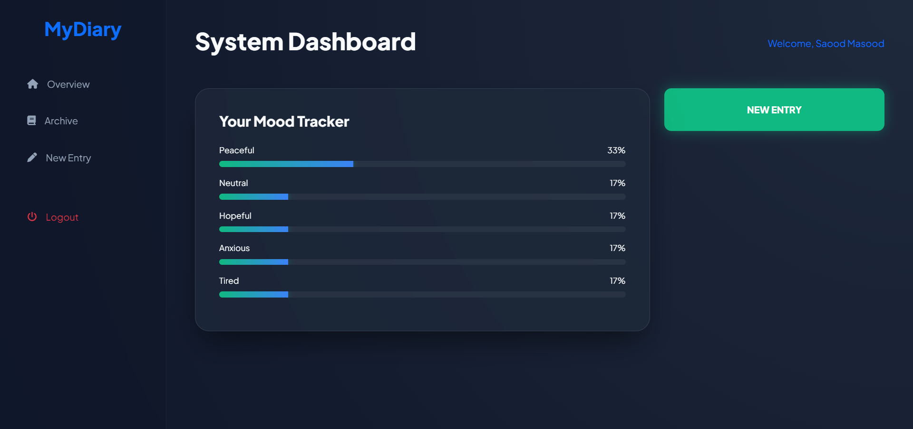
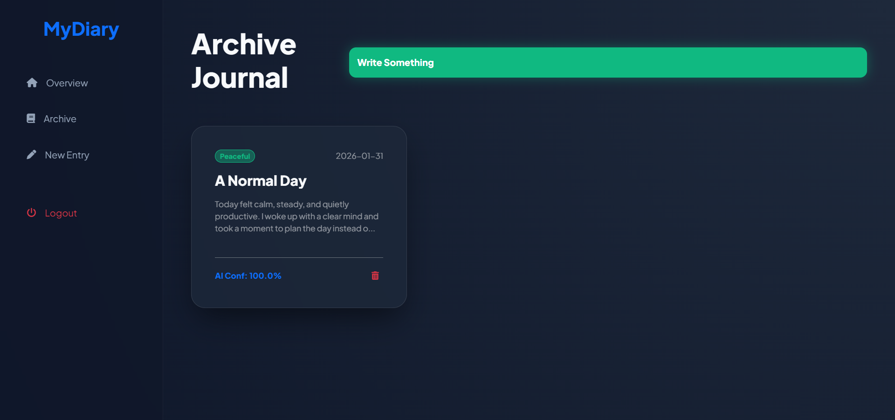
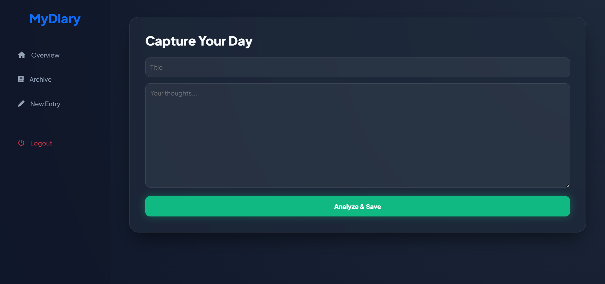

# 📝 MyDiary

## **Overview**

**MyDiary** is a full-stack web application that reimagines traditional journaling by combining private diary writing with probabilistic emotional analysis. Instead of labeling entries as simply *positive* or *negative*, MyDiary estimates the likelihood of multiple emotional states within each entry and visualizes long-term mood trends in an interactive dashboard.

The project is built around the idea that human emotions are layered and overlapping. A single diary entry can express calmness and loneliness, hope and anxiety, or gratitude and exhaustion at the same time. MyDiary captures this emotional complexity through a **12-mood probability spectrum**, offering users a reflective and analytical view of their emotional patterns over time.

All diary entries are private, user-specific, and securely managed.
---

Video Demo: https://youtu.be/lmjDTEZmsgo

---

## **Screenshots**





---

## **Key Features**

- Secure user authentication (registration & login)
- Distraction-free diary writing interface
- Automatic emotional analysis for each entry
- Interactive dashboard showing aggregated mood probabilities
- Archive of past entries in a card-based layout
- Modal-based reading experience (no page reloads)
- Secure deletion of entries via POST requests
- Fully private, session-protected user data

---

## **Emotional Analysis Model**

MyDiary evaluates each diary entry across **12 emotional states**:

**Joyful, Sad, Angry, Anxious, Peaceful, Tired, Lonely, Confident, Confused, Grateful, Hopeful, Inspired**

Rather than assigning a single label, the system distributes probability scores across multiple moods, allowing emotional overlap and nuance.

---

## **How Emotional Analysis Works**

The sentiment engine is implemented in **helpers.py** and intentionally separated from Flask routing logic for modularity and clarity.

- Each mood is associated with a curated keyword set  
- Diary text is normalized and scanned for emotional keywords  
- Intensity modifiers (e.g., *very*, *extremely*, *slightly*) adjust emotional weights  
- Weighted scores are normalized into percentage probabilities  
- The final output reflects multiple coexisting emotions  

This keyword-based approach prioritizes **transparency and explainability** over black-box machine learning.

---

## **Project Structure**

MyDiary/
│── app.py
│── helpers.py
│── diary.db
│
├── templates/
│ ├── layout.html
│ ├── index.html
│ ├── write.html
│ ├── entries.html
│ ├── login.html
│ └── register.html
│
├── static/
│ └── styles.css


---

## **Core Files**

**app.py**  
Initializes the Flask application, manages sessions, authentication, and routing.

Key routes:
- `/` – Mood analytics dashboard  
- `/login` & `/register` – User authentication  
- `/write` – Diary submission and analysis  
- `/entries` – Entry archive  
- `/delete` – Secure entry deletion  

**helpers.py**  
Encapsulates all emotional analysis logic, including keyword dictionaries, intensity handling, and probability normalization.

**static/styles.css**  
Defines the application’s visual identity using a dark **Deep Midnight** theme with glassmorphism effects, subtle animations, and neon accents.

---

## **Design Decisions**

- A **12-mood spectrum** was chosen to avoid oversimplified sentiment classification  
- Modal-based entry viewing keeps users within context and improves usability  
- Custom styling reinforces the project as more than a basic CRUD application  
- Security measures include hashed passwords, session protection, and POST-only destructive actions  

---

## **Limitations & Future Improvements**

**Current limitations**
- Keyword-based analysis cannot detect sarcasm or deep contextual meaning  
- Emotional interpretation is rule-based rather than learned  

**Potential enhancements**
- NLP or ML-based sentiment analysis  
- Mood timelines and historical trend graphs  
- Entry tagging and filtering  
- Data export functionality  
- Mobile-optimized interface  

---

## **Installation and Local Setup**
To get a local copy up and running, follow these simple steps:

1. Clone the repository:
```bash
git clone https://github.com/saoodmasood1/MyDiary.git
cd MyDiary
```

2. Install dependencies It is recommended to use a virtual environment, but you can install directly via:

```bash
pip install -r requirements.txt
```

3. Initialize the Database Run the initialization script to generate the diary.db file and the necessary tables:

```bash
python make_diarydb.py
```

4. Run the Application:
```bash
python -m flask run
```

Access the app at http://127.0.0.1:5000 in your browser.

## **Final Note**
MyDiary represents a transition from writing isolated scripts to designing a complete, user-focused web application. It integrates backend logic, frontend design, data persistence, and algorithmic thinking into a cohesive product centered on self-reflection and emotional awareness.